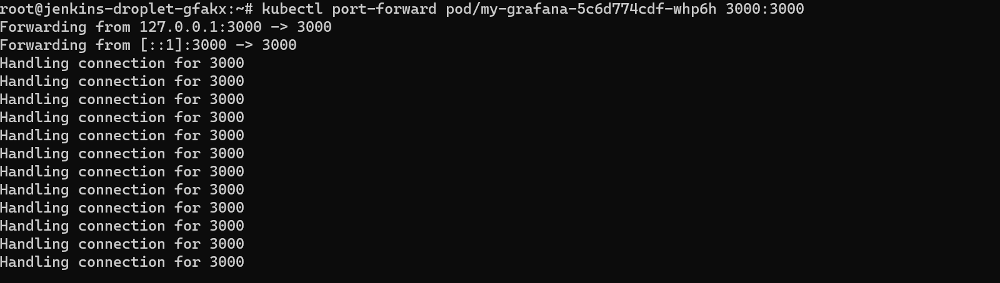

# End-to-End CI/CD Pipeline with GitOps workflow, Terraform, Jenkins, ArgoCD, Azure vm , AKS, Prometheus, and Grafana.

In this guide, we walk through a robust CI/CD pipeline that showcases a GitOps workflow using various tools and technologies. The process begins with infrastructure provisioning via Terraform, then moves to application building and packaging with Jenkins, and continuous deployment using ArgoCD. Post deployment, we have Prometheus and Grafana in place for monitoring and visualization of our applications. 

img .a
## Overview
The GitOps workflow is embedded throughout the process:

1. **Source Code Management (SCM)**: Developers push code to the application repository.
2. **Continuous Integration (CI)**: Jenkins detects changes in the application repository, builds a new version of the application, and pushes the new version to a container registry, and also triggers repo 2 (`gitops-argocd-manifest`)
3. **GitOps Flow**:
    - Jenkins updates the manifest repository (`gitops-argocd-manifest`) with the new version of the application.
    - ArgoCD, watching the manifest repository, detects the change and deploys the new version of the application to the Kubernetes cluster.
4. **Continuous Deployment (CD)**: ArgoCD ensures that the live state in the cluster matches the desired state defined in the manifest repository. If they differ, ArgoCD brings the live state in line with the desired state.
5. **Monitoring**: Once deployed, Prometheus collects metrics from the application, and Grafana provides visualization based on these metrics.

This end-to-end process ensures that the entire lifecycle of the application, from code push to deployment and monitoring, is automated, efficient, and transparent.

## Detailed Steps
1. **Infrastructure Setup with Terraform**: Initialization of the required infrastructure including VMs and Azure Kubernetes Service (AKS) using Terraform.
2. **Jenkins Installation and Configuration**: Setting up Jenkins on a VM, including the necessary dependencies and plugins.
3. **Continuous Integration with Jenkins**: Building a CI pipeline in Jenkins to ensure code quality and build Docker images.
4. **Continuous Deployment with ArgoCD**: Deploying applications to Kubernetes using ArgoCD based on the changes in the Git repository.
5. **Securing Applications with Cert-Manager and DNS Configuration**: Setting up Cert-Manager for Kubernetes and configuring DNS for domain pointing and SSL/TLS certification.
6. **Monitoring with Prometheus and Grafana**: Installing and integrating Prometheus and Grafana for real-time application monitoring.  
### Clone the following repo :  
REPO 1 : `https://github.com/gfakx/gitops-argocd-workflow.git`  
REPO 2 : `https://github.com/gfakx/gitops-argocd-manifest.git`
### 1. Infrastructure Setup with Terraform

Terraform is utilized to script and automate the infrastructure setup. This ensures that the environment is consistent and can be easily replicated.  
- **cd into the `gitops-argocd-workflow` root folder and create a .tfvars and provide variable values**: ( This will create the VM & AKS on Azure)
- **Initialize Terraform**: `terraform init`
- **Plan the Deployment**: `terraform plan`
- **Apply the Terraform Configuration**: `terraform apply`

### 2. Jenkins Installation and Configuration

- **ssh into vm**: follow onscreen instruction on azure portal 
- **Locate the jenkins-install.sh file in the `gitops-argocd-workflow`** .
- **Make file executable** `chmod +x jenkins-install.sh` .
-  `sh jenkins-install.sh`
-  `systemctl status jenkins`
- **Get jenkins password from cli** `cat /var/lib/jenkins/secrets/initialAdminPassword` (img 2.b)
- **login to jenkins with VM public ip** (img 2.c)
- **Configure Necessary Plugins**: Install plugins like Docker,SonarQube, Kubernetes, and more.
- **Set up Build Jobs**: Create two Jenkins pipeline job gitops-argocd-worfklow & gitops-argocd-manifest.
- **Push to Dockerhub** : Repo 1 pushes built image to dockerhub and also triggers the build process of Repo 2

img 2.a

img 2.b

img 2.c

### 3. Continuous Integration with Jenkins

The CI process is crucial to ensure code quality and build artifacts.

- **Trigger Builds**: Upon a Git push, Jenkins automatically triggers the build process.
- **Run Tests**: As part of the build process, run unit and integration tests.
- **Build Docker Images**: If tests pass, build a Docker image and push it to a container registry.  

img 3.a

img 3.b
### 4. Continuous Deployment with ArgoCD

ArgoCD provides GitOps capabilities, ensuring that the Kubernetes cluster state matches the desired state specified in a Git repository.

- **Install ArgoCD**: Deploy ArgoCD on the Kubernetes cluster.  
  - `kubectl create namespace argocd`
  - `kubectl apply -n argocd -f https://raw.githubusercontent.com/argoproj/argo-cd/stable/manifests/install.yaml`
  - `kubectl patch svc argocd-server -n argocd -p '{"spec": {"type": "LoadBalancer"}}'`
  - `argocd admin initial-password -n argocd`
  - `kubectl get pods -n argocd`
- **Connect Git Repository**: Link ArgoCD to the Git repository containing Kubernetes manifests.
- **Automated Deployment**: When the repository is updated, ArgoCD triggers a deployment to the Kubernetes cluster.

img 4.a

img 4.b

img 4.c
### 5. Securing Applications

Securing the application is crucial, especially when it's exposed to the internet.

- **Install Nginx**
  - `kubectl create ns ingress-nginx`
  - `helm repo add ingress-nginx https://kubernetes.github.io/ingress-nginx`
  - `helm repo update`
  - `helm install my-nginx-con ingress-nginx/ingress-nginx -n ingress-nginx`  
  

img 5.a

img 5.b
- **Install Cert-Manager**: Deploy Cert-Manager to the Kubernetes cluster.
  - ` kubectl apply -f https://github.com/cert-manager/cert-manager/releases/download/v1.12.3/cert-manager.crds.yaml`
  - `helm repo add cert-manager https://charts.jetstack.io`
  - `help repo update`
  - `helm install my-cert-manager cert-manager/cert-manager --version 1.12.3`
- **Configure DNS**: Point the domain to the application's IP address. 
- **SSL/TLS Configuration**: Using Cert-Manager, set up SSL/TLS certificates for the domain.

img 5.c
### 6. Monitoring with Prometheus and Grafana

Monitoring provides insights into the application's performance and health.

- **Install Prometheus**: Use Helm to deploy Prometheus to the Kubernetes cluster.
  - `helm repo add prometheus-community https://prometheus-community.github.io/helm-charts`
  - `helm repo update`
  - `helm install my-prometheus prometheus-community/prometheus --version 23.4.0`
- **Install Grafana**: Similarly, use Helm to deploy Grafana.
  - `helm repo add grafana https://grafana.github.io/helm-charts`
  - `helm repo update`
  - `helm install my-grafana grafana/grafana --version 6.59.0`
  - Port forward to access grafana  `kubectl port-forward pod/my-grafana-5cd7-whp6h 3000:3000`
- **Integration**: Integrate Grafana with Prometheus to visualize metrics.

img 6.a

img 6.b
## GitHub Webhook for Automated Triggers

To fully automate the CI/CD process, set up a GitHub webhook. This ensures that any push to the repository (`gitops-argocd-workflow`) triggers the Jenkins job. Once Jenkins completes its tasks, it triggers the next repository (`gitops-argocd-manifest`). This, in turn, prompts ArgoCD to deploy the updates, achieving a complete automated CI/CD flow.

---

**Note**: This documentation provides a high-level overview. Specific commands, configurations, and tools might require additional setup and fine-tuning to work in various environments.
"""
